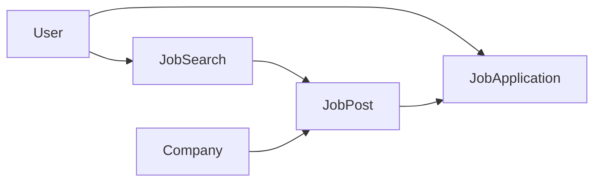

# Jobhunter

A Rails application for **discovering job listings** (via automated searches tied to SerpAPI’s Google Jobs engine), **browsing and filtering** those listings, and **tracking your applications** on a simple kanban-style board.

This document walks through how the major pieces fit together: models, concerns, services, jobs, controllers, and supporting code.

---

## Tech stack

- **Ruby on Rails 8** with **PostgreSQL**
- **Authentication**: session-based login with `has_secure_password` (`bcrypt`)
- **Background work**: **Sidekiq** in development (see `config/application.rb`). **Production** is configured to use **Solid Queue** (`config/environments/production.rb`); adjust if you standardize on one adapter everywhere.
- **Pagination**: Kaminari (`JobPost` index)
- **External API**: [SerpAPI](https://serpapi.com) Google Jobs (`google_search_results` gem, `ENV["SERPAPI_API_KEY"]`)
- **Front end**: Hotwire (Turbo + Stimulus), importmap, Propshaft

---

## Domain overview




- A **User** owns **JobSearches** (saved search configurations) and **JobApplications** (their pipeline for specific **JobPosts**).
- Each **JobPost** belongs to a **Company** and to the **JobSearch** that produced or grouped it (including a synthetic “manual entry” search for user-added posts).
- Scraping runs in the background and creates **Companies** and **JobPosts**; it does not create applications for you.

---

## Data model (Active Record)

### `User` (`app/models/user.rb`)

- Credentials: `email` (unique), `password` / `password_digest`, `name`.
- Associations: `has_many :job_searches`, `has_many :job_applications`.
- Used everywhere the app scopes data to `current_user` after login.

### `JobSearch` (`app/models/job_search.rb`)

Represents **one configured scrape**: title query, optional location, remote flag, language, timezone, optional daily `**runtime`** (time of day stored on the record), and `**board_relevance**`.

- `**board_relevance**`: an ordered list of **job board names** as they appear on Google Jobs “apply” options (e.g. `LinkedIn`, `Indeed`). The scraper uses this to prefer certain apply links when multiple exist—not URLs.
- Validations enforce language code shape, timezone name, and sensible `board_relevance` entries (non-blank strings, max length).
- `**number_of_jobs`**: cached count of related `job_posts`; updated when posts are created/destroyed (via `JobPost` callbacks calling `job_search.update_number_of_jobs!`).

### `Company` (`app/models/company.rb`)

- `name` (required), optional `description` (often filled when first seen from scrape data).
- `has_many :job_posts`. Companies are shared across searches when the name matches.

### `JobPost` (`app/models/job_post.rb`)

Core listing record: title, website (apply URL), description, location, remote, `posted_at`, denormalized **pay** and **experience** numeric columns for filtering.

- **Filtering the index** is delegated to `**JobPosts::Filter`** (`app/models/job_posts/filter.rb`): company name (ILIKE), remote, contract vs full-time heuristics, pay range, experience range. `**JobPostsController**` permits only filter keys, then `**JobPost.filtered(...)**` applies them.
- **Description-derived behavior** lives in concerns (see below): pay/experience parsing, skills, contract detection, `**suggested_jobs`**.
- **Callbacks**: default `posted_at` on create; before save, populate `pay_range_*` and `experience_years_*` from description text; after save/destroy, refresh parent search’s `number_of_jobs`.

### `JobApplication` (`app/models/job_application.rb`)

- One row per user per job post (`uniqueness` on `job_post_id` scoped to `user_id`).
- `**JobApplication::STATUSES`**: `applied`, `interviewing`, `rejected`, `ghosted`—single source of truth for validation and UI.
- `**applied_at**` required; defaults set on create.
- **Manual “ghosted”**: the HTML form sends `**mark_as_ghosted`**; the controller merges that with nested `job_application` params so ghosting is explicit, not time-based.

---

## Concerns and supporting model objects

### `JobPost::DescriptionEnrichment` (`app/models/concerns/job_post/description_enrichment.rb`)

Included by `JobPost`. Holds regex dictionaries and logic to:

- Extract and parse **salary ranges** from description text into `pay_range_min` / `pay_range_max`.
- Extract **years of experience** (numeric and word-based phrases) into `experience_years_min` / `experience_years_max`.
- `**contract?`**: heuristic on title + description.
- `**extracted_skills**`: keyword/regex map (Ruby, Rails, React, AWS, etc.) for light skill tagging.

### `JobPost::SimilarListings` (`app/models/concerns/job_post/similar_listings.rb`)

- `**suggested_jobs**`: ranks other posts by overlap of `extracted_skills` (used on job post **show**).

### `JobPosts::Filter` (`app/models/job_posts/filter.rb`)

- PORO invoked as `**JobPosts::Filter.call(filter_params)`** with a **Hash** (or permitted params converted via `**to_h`**) already allowlisted in `**JobPostsController#job_post_filter_params**`. Builds an `ActiveRecord::Relation` with joins/scopes; does not call `**permit**` itself.

---

## Services

### `JobScraper` (`app/services/job_scraper.rb`)

- Initialized with `**job_search:**` (reads title, location, remote, language, board list, target count).
- `**#scrape**`: pages SerpAPI Google Jobs (`GoogleSearch` / `google_search_results`), deduplicates by title + company, normalizes apply URLs (e.g. strips `utm_*` query params), sorts apply options using `**board_relevance**`, parses relative posted-at strings.
- **No database writes**—returns an array of hashes for the job to persist.

---

## Jobs

### `JobScraperJob` (`app/jobs/job_scraper_job.rb`)

- `**perform(job_search_id)`** enqueues only an ID (not the full `JobSearch` record).
- Loads the search; sets `Time.zone` from the search’s timezone; runs `**JobScraper**`, then `**import_scrape_results!**`.
- `**import_scrape_results!**` wraps all `**Company**` / `**JobPost**` creates in a **single transaction** so a failure mid-import does not leave a partial batch.
- `**find_or_create_by!`** on posts keys on `job_search`, `title`, `company`, `website`; the block sets description, location, remote, `posted_at` only when **creating** a new row.
- Errors are logged and **re-raised** so the queue can retry (per your Sidekiq / Solid Queue policy).

### `ApplicationJob` (`app/jobs/application_job.rb`)

Standard Rails base class for shared job configuration (retries, etc., if you add them later).

---

## Controllers

### `ApplicationController`

- `**current_user`** from `session[:user_id]`; `**require_login**` redirects to login.
- `**allow_browser versions: :modern**` (Rails default for modern-only features).

### `SessionsController` / `UsersController`

Sign in, sign out, registration (`signup`).

### `DashboardController`

- `**index**`: logged-in home—lists the user’s **job searches** and **job applications** (for the dashboard view).

### `JobSearchesController`

- Full CRUD for **JobSearch** (nested under the current user).
- `**trigger`** (`POST …/job_searches/:id/trigger`): enqueues `**JobScraperJob.perform_later(job_search.id)**`.

### `JobPostsController`

- `**index**`: `**JobPost.filtered(job_post_filter_params)**` + pagination; loads which of the visible posts the user has already applied to.
- `**show**`: suggested jobs + optional `JobApplication` for current user.
- `**new` / `create**`: manual job entry; finds or creates `**Company**`, attaches post to a per-user synthetic `**JobSearch**` titled **“Manual Job Entries”** so every post stays tied to a search.

### `JobApplicationsController`

- `**create`**: nested under `**job_posts**`—“I applied to this post.”
- `**index**`: board grouped by `**JobApplication::STATUSES**`.
- `**show` / `edit**`: same form template; updates status, contact info, followed-up flag.
- `**update**`: accepts top-level JSON params (`status`, `followed_up`) for drag-and-drop / checkboxes, or nested `job_application` for the form; validates status against `**JobApplication::STATUSES**`; merges `**mark_as_ghosted**` for HTML ghosting.

### `Api::JobPostsController`

- `**index**`: JSON list of posts with company—useful for integrations; **no auth** in the current code—treat as public only if that is intentional.

---

## Helpers

### `JobPostsHelper`

- `**job_post_description_with_highlighted_pay(job_post)`**: formats description with `simple_format` and wraps the extracted pay snippet in a highlight span (keeps presentation out of the model).

### `JobSearchesHelper`

Present for search-related views (extend as needed).

---

## Front-end notes (views + JS)

- **Job search form** (`job_searches/new.html.erb`): Stimulus controller `**job_search_controller.js`** for dynamic “preferred job boards” rows and client-side checks.
- **Application tracker** (`job_applications/index.html.erb`): drag-and-drop between columns issues **PATCH** with JSON `status`; inline “followed up” checkbox PATCHes `job_application: { followed_up }`.

---

## Routes (summary)


| Area                              | Notes                              |
| --------------------------------- | ---------------------------------- |
| `/`                               | `dashboard#index` (requires login) |
| `/dashboard`                      | Same dashboard                     |
| `/job_searches`                   | CRUD + `POST …/trigger`            |
| `/job_posts`                      | index, show, new, create           |
| `/job_posts/:id/job_applications` | POST create                        |
| `/job_applications`               | index, show, edit, update          |
| `/login`, `/logout`, `/signup`    | Sessions + users                   |
| `/api/job_posts`                  | JSON index                         |


---

## Configuration and operations

### Environment

- `**SERPAPI_API_KEY`**: required for live scraping.

### Background processing

- **Development**: `config.active_job.queue_adapter = :sidekiq` — run Redis, Sidekiq, and the Rails server.
- **Production**: configured for **Solid Queue** and an optional SQLite queue DB in `database.yml`; align adapters with how you deploy.

### Tests

- RSpec (`spec/`), with request, model, and job specs covering scraper, filters, applications, etc.

### Typical setup

```bash
bundle install
bin/rails db:prepare
bin/dev   # or rails s + separate JS watcher, plus Sidekiq as needed
```

---

## File map (quick reference)


| Path                             | Role                                                        |
| -------------------------------- | ----------------------------------------------------------- |
| `app/models/`                    | `User`, `JobSearch`, `Company`, `JobPost`, `JobApplication` |
| `app/models/concerns/job_post/`  | Description parsing + similar listings                      |
| `app/models/job_posts/filter.rb` | Index filtering query object                                |
| `app/services/job_scraper.rb`    | SerpAPI scrape orchestration                                |
| `app/jobs/job_scraper_job.rb`    | Async import + transaction                                  |
| `app/controllers/`               | HTTP layer; `api/` for JSON                                 |
| `app/helpers/`                   | View helpers (e.g. pay highlighting)                        |
| `app/javascript/controllers/`    | Stimulus (e.g. job search form)                             |
| `config/routes.rb`               | URL map                                                     |
| `db/schema.rb`                   | Canonical schema                                            |


---

## Design choices (for maintainers)

1. **Job posts always belong to a** `JobSearch`, including manual entries, via a dedicated search per user, so counts and foreign keys stay consistent.
2. **Scrape jobs take an ID only**, avoids serializing full AR objects in the queue.
3. **Import is transactional**, all-or-nothing per scrape batch for DB consistency. (We shouldn't really care if one errors and just skip to the next one)
4. **Statuses are centralized on** `JobApplication`, controllers and views reference `JobApplication::STATUSES`.
5. **Heavy** `JobPost` **behavior is split**, concerns + `JobPosts::Filter` + helper keep the AR class focused on persistence and associations.

If you extend the app, prefer new **service objects** for integrations, **query objects** under `app/models/.../filter.rb` (or `app/queries`) for complex reads, and **jobs** only for async orchestration and retries.