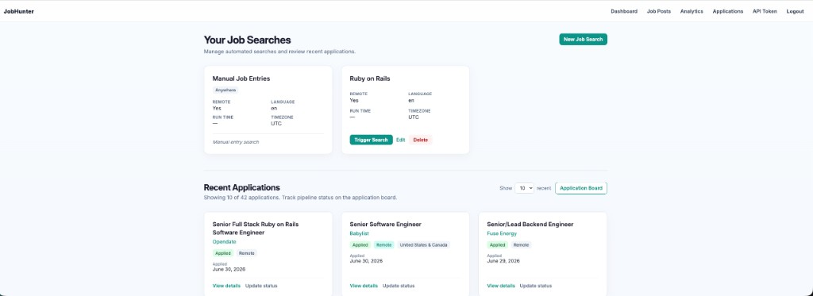
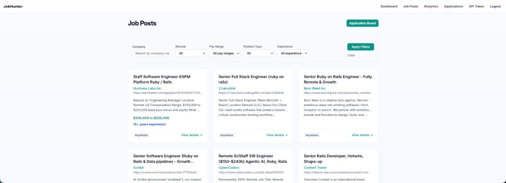
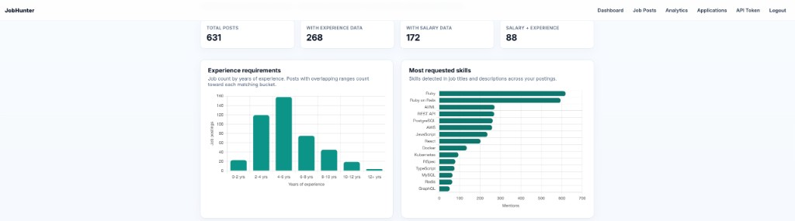
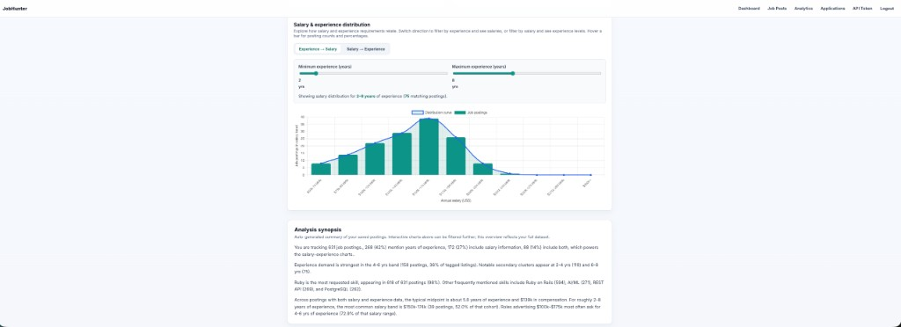
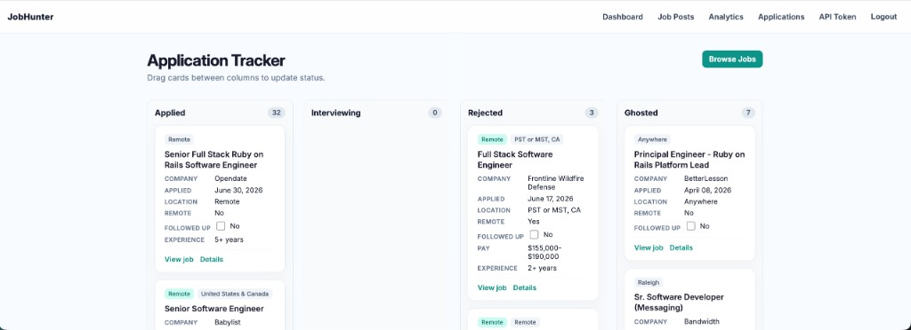
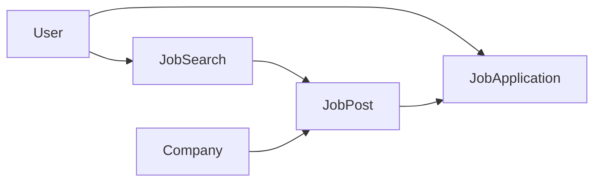

# JobHunter

A Rails application for **discovering job listings**, **browsing and filtering** them, **analyzing market trends** in your saved posts, and **tracking applications** on a kanban-style board.

Listings come from three paths:

1. **Automated searches** — SerpAPI’s Google Jobs engine, triggered manually from the dashboard (scheduled runs are not implemented yet).
2. **Manual web entry** — add a job from the Job Posts UI.
3. **Chrome extension** — scrape a job page in the browser and `POST` it to the API.

This document describes the current setup: models, services, jobs, controllers, security, and how the pieces fit together.

---

## Screenshots

### Dashboard

Manage automated job searches, trigger scrapes, and preview recent applications (with a configurable limit).



### Job Posts

Browse saved listings in a card grid with filters for company, remote, pay range, position type, and experience.



### Analytics

Explore experience demand, top skills, and salary distributions with interactive charts and an auto-generated synopsis.





### Application Board

Track applications across pipeline stages with drag-and-drop status updates.



---

## Features

| Area | What you can do |
|------|-----------------|
| **Dashboard** | Manage job searches (create, edit, delete, trigger scrape). Preview recent applications (default 10; choose 5/10/20/50 via `?applications_limit=`). |
| **Job posts** | Card index with filters (company, remote, pay range, position type, experience). Detail view with pay highlighting, suggested similar posts, and “I applied” action. |
| **Analytics** | Charts for experience breakdown, top skills, and salary↔experience distribution; auto-generated synopsis. Scoped to the current user’s posts. |
| **Application board** | Kanban columns (`applied`, `interviewing`, `rejected`, `ghosted`); drag-and-drop status updates; inline “followed up” checkbox. |
| **API + extension** | Bearer-token auth; `GET`/`POST /api/job_posts` for the Chrome side panel. Tokens are SHA-256 digests — plaintext shown once after generate/regenerate. |

---

## Tech stack

| Layer | Choice |
|-------|--------|
| Framework | **Ruby on Rails 8** |
| Database | **PostgreSQL** |
| Auth | Session-based login (`has_secure_password` / bcrypt); `reset_session` on login, signup, and logout |
| Background jobs | **Solid Queue** in production. **Development** uses the in-process `:async` adapter (no Redis). Optionally `JOB_QUEUE_ADAPTER=sidekiq` with Redis + Sidekiq. |
| Pagination | Kaminari (`JobPost` index) |
| Job discovery | [SerpAPI](https://serpapi.com) Google Jobs (`google_search_results` gem, `ENV["SERPAPI_API_KEY"]`) |
| Front end | Hotwire (Turbo + Stimulus), importmap, Propshaft, Tailwind CSS (via `bin/dev`) |
| Charts | Chart.js (loaded on analytics page from jsDelivr CDN) |
| Security | **rack-attack** throttles (login, signup, API); CSP in **report-only** mode; **rack-cors** for Chrome extension → `/api/*` |
| Tests / CI | RSpec, SimpleCov, Brakeman, RuboCop, importmap audit — see `.github/workflows/ci.yml` |

---

## Getting started

### Prerequisites

- Ruby (see `.ruby-version`)
- PostgreSQL
- `SERPAPI_API_KEY` — required for live automated scraping (not needed for manual entry or the Chrome extension)

### Setup

```bash
bundle install
yarn install          # Tailwind / PostCSS
bin/rails db:prepare
```

### Run locally

```bash
bin/dev               # Rails server + Tailwind watcher (recommended)
# or: bin/rails server
```

Open `http://localhost:3000`, sign up, and use the nav: Dashboard, Job Posts, Analytics, Applications, API Token.

### Chrome extension

See [`chrome-extension/README.md`](chrome-extension/README.md). Summary:

1. Generate an API token under **API Token** in the nav.
2. Load `chrome-extension/` as an unpacked extension in Chrome.
3. Set server URL and token in extension options.
4. Open a job page → extension side panel → **Save to JobHunter**.

### Environment variables

| Variable | Purpose |
|----------|---------|
| `SERPAPI_API_KEY` | SerpAPI Google Jobs searches |
| `JOB_QUEUE_ADAPTER` | Optional: `sidekiq` in development (default is `async`) |
| `REDIS_URL` | Redis URL when using Sidekiq (default `redis://localhost:6379/0`) |
| `PGHOST`, `PGUSER`, `PGPASSWORD` | PostgreSQL connection (CI and non-default local setups) |

---

## Domain overview



- A **User** owns **JobSearches** and **JobApplications**.
- Each **JobPost** belongs to a **Company** and a **JobSearch** (including a per-user synthetic **“Manual Job Entries”** search).
- Scraping creates **Companies** and **JobPosts** only — not applications.

---

## Data model

### `User` (`app/models/user.rb`)

- `name`, `email` (unique), `password_digest`.
- `api_token_digest` — SHA-256 hash of the Chrome/API bearer token (plaintext never stored).
- `has_many :job_searches`, `has_many :job_applications`.
- `regenerate_api_token!` / `authenticate_api_token` for API auth.

### `JobSearch` (`app/models/job_search.rb`)

One configured scrape (or the synthetic manual bucket):

- `job_title`, optional `location`, `remote`, `language_code`, `timezone`.
- `runtime` — time-of-day stored on the record (scheduling not wired up yet).
- `board_relevance` — ordered job board names from Google Jobs apply options (e.g. `LinkedIn`, `Indeed`); used to pick preferred apply URLs.
- `number_of_jobs` — cached count; updated via `JobPost` callbacks.
- `manual?` — true for the **“Manual Job Entries”** search; cannot be edited, deleted, or triggered.

### `Company` (`app/models/company.rb`)

- `name` (required), optional `description`.
- Shared across searches when names match.

### `JobPost` (`app/models/job_post.rb`)

- `title`, `website` (apply URL, validated as safe http/https), `description`, `location`, `remote`, `posted_at`.
- Denormalized `pay_range_min` / `pay_range_max`, `experience_years_min` / `experience_years_max` for filtering.
- Index filtering via `JobPosts::Filter` (company ILIKE, remote, contract vs full-time, pay range, experience range).
- Concerns: `JobPost::DescriptionEnrichment` (pay, experience, skills, contract detection), `JobPost::SimilarListings` (`suggested_jobs` on show).

### `JobApplication` (`app/models/job_application.rb`)

- One per user per job post.
- `STATUSES`: `applied`, `interviewing`, `rejected`, `ghosted`.
- `applied_at` (required), `contact_info`, `followed_up`.
- HTML form uses `mark_as_ghosted` checkbox; controller merges into status.

---

## Services

| Service | Role |
|---------|------|
| `JobScraper` | SerpAPI Google Jobs: paginate, dedupe, normalize apply URLs (strip `utm_*`), respect `board_relevance`, parse relative posted dates. Returns hashes — no DB writes. Uses `URI.decode_www_form` (Ruby 3.4–compatible). |
| `JobPosts::CreateManual` | Shared by web `JobPostsController#create` and `Api::JobPostsController#create`. Finds/creates company + manual `JobSearch`. |
| `JobPosts::Filter` | Query object for job post index filters. |
| `JobPosts::Analytics` | Aggregates experience, skills, and salary data for the current user’s posts. |
| `JobPosts::AnalyticsSynopsis` | Plain-language summary from analytics result. |
| `JobPosts::SafeUrl` | Validates http/https URLs for links and `JobPost#website`. |

---

## Jobs

### `JobScraperJob` (`app/jobs/job_scraper_job.rb`)

- `perform(job_search_id)` — ID only in the queue payload.
- Skips missing or manual searches.
- Runs `JobScraper`, then `import_scrape_results!` in a **single transaction** (`find_or_create_by!` on company + post).
- Errors logged and re-raised for queue retry.

---

## HTTP layer

### Routes

| Path | Controller | Notes |
|------|------------|-------|
| `/`, `/dashboard` | `DashboardController#index` | Login required |
| `/job_searches` | `JobSearchesController` | CRUD + `POST …/trigger` |
| `/job_posts` | `JobPostsController` | index, show, new, create |
| `/job_posts/:id/job_applications` | `JobApplicationsController#create` | “I applied” |
| `/job_applications` | `JobApplicationsController` | Board + show/edit/update |
| `/analytics` | `AnalyticsController#index` | Login required |
| `/api_token` | `ApiTokensController` | show, create (regenerate) |
| `/api/job_posts` | `Api::JobPostsController` | JSON index + create; **Bearer token required** |
| `/login`, `/logout`, `/signup` | Sessions / Users | |
| `/up` | Health check | |

### Controllers (highlights)

- **`ApplicationController`** — `current_user` from `session[:user_id]`; `require_login`.
- **`DashboardController`** — job searches + paginated recent applications (`APPLICATION_LIMIT_OPTIONS`: 5, 10, 20, 50; default 10).
- **`JobSearchesController`** — blocks edit/update/delete/trigger on manual search.
- **`JobApplicationsController`** — JSON `PATCH` for drag-and-drop and follow-up checkbox; HTML form for full edit.
- **`Api::BaseController`** — `Authorization: Bearer <token>`; scopes all API data to `current_user`.

### Helpers

- **`JobPostsHelper`** — safe external links (`JobPosts::SafeUrl`), sanitized description with pay highlight.

---

## Front end

- **Stimulus** — `job_search_controller.js` for dynamic board-relevance rows on the job search form.
- **Application board** — inline JavaScript for drag-and-drop and follow-up `PATCH` (see `job_applications/index.html.erb`).
- **Analytics** — Chart.js with range sliders and distribution mode toggle.
- **Styles** — page-scoped CSS (`job_posts.css`, `analytics.css`, `dashboard.css`, `job_applications.css`) plus shared tokens in `application.css`.
- **Navigation** — Dashboard, Job Posts, Analytics, Applications, API Token.

---

## Security

| Measure | Implementation |
|---------|----------------|
| API tokens | Stored as SHA-256 digest; shown once in session after generate |
| Sessions | `reset_session` on login, signup, logout |
| Rate limiting | rack-attack on `/login`, `/signup`, `/api/*` (disabled in test) |
| CORS | `chrome-extension://` and `http://localhost:3000` → `/api/*` |
| CSP | Report-only (`config/initializers/content_security_policy.rb`) |
| XSS | Sanitized job descriptions; `JobPosts::SafeUrl` for outbound links |
| Strong params | Controllers permit explicit param lists |

---

## Tests and CI

```bash
bundle exec rspec
```

GitHub Actions (`.github/workflows/ci.yml`):

- Brakeman (Ruby security scan)
- importmap audit (JS dependencies)
- RuboCop
- RSpec with PostgreSQL 16 service

SimpleCov enforces ~90% line coverage when the full suite runs locally.

---

## File map

| Path | Role |
|------|------|
| `app/models/` | `User`, `JobSearch`, `Company`, `JobPost`, `JobApplication` |
| `app/models/concerns/job_post/` | Description enrichment, similar listings |
| `app/models/job_posts/filter.rb` | Index filtering |
| `app/services/job_scraper.rb` | SerpAPI orchestration |
| `app/services/job_posts/` | Manual create, analytics, safe URL |
| `app/jobs/job_scraper_job.rb` | Async scrape + import |
| `app/controllers/api/` | Token-authenticated JSON API |
| `app/views/analytics/` | Analytics dashboard |
| `app/javascript/controllers/` | Stimulus |
| `chrome-extension/` | Browser extension (side panel + extractors) |
| `config/routes.rb` | URL map |
| `db/schema.rb` | Canonical schema |

---

## Design choices

1. **Every job post belongs to a `JobSearch`** — including manual entries via a dedicated search per user.
2. **Scrape jobs enqueue an ID only** — avoids serializing Active Record objects in the queue.
3. **Import is transactional** — all-or-nothing per scrape batch (see maintainer TODOs below).
4. **Statuses live on `JobApplication::STATUSES`** — single source for validation, board, and forms.
5. **Heavy `JobPost` logic is split** — concerns, filter query object, and services keep the model focused.
6. **Manual entry is unified** — web form and Chrome extension both use `JobPosts::CreateManual`.

---

## Maintainer TODOs

1. **`import_scrape_results!`** — consider per-row import instead of one transaction; collect failures for retry or user feedback.
2. **Scheduled searches** — cron/hourly job to find `JobSearch` records whose `runtime` matches and enqueue `JobScraperJob`.
3. **CSP** — move inline scripts (application board, analytics) to Stimulus and tighten `script-src`.
4. **In-house discovery** — optional future: adapter pattern to reduce SerpAPI dependency (see prior design discussion).
